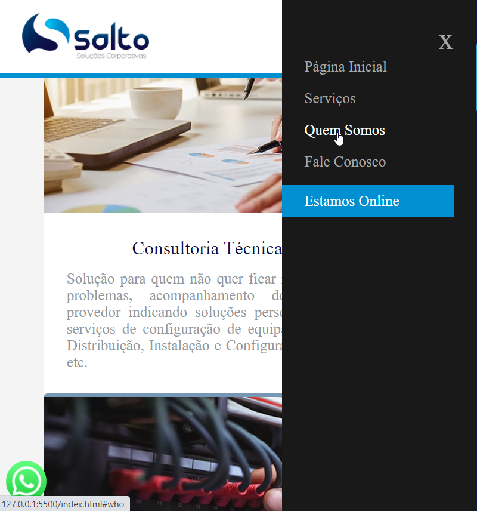

# Example Web
[](https://github.com/Mascimo/Example-Web/blob/main/LICENSE) 

# Sobre o projeto

<!-- link do projeto  -->

Example Web é uma aplicação front end web e mobile construída durante o 1ª modulo do curso **Desenvolvimento Web**.

A aplicação consiste em uma página empresarial, onde são mostrados de forma agradável é clara, seus produtos e serviços. Além de disponibilizar varias opções de localização é contato interativo.

## Layout mobile
</img>

 

## Layout web


# Tecnologias utilizadas
## Back end
- JS
## Front end
- HTML
- CSS
- JS

# Como executar o projeto

## Front end
Pré-requisitos: npm / yarn

```bash
# clonar repositório
git clone link

# entrar na pasta do projeto front end web
cd Example Web

# executar o projeto
index
```

# Autor

Pedro Henrique Mascimo

https://www.linkedin.com/in/pedro-henrique-78a204135/
